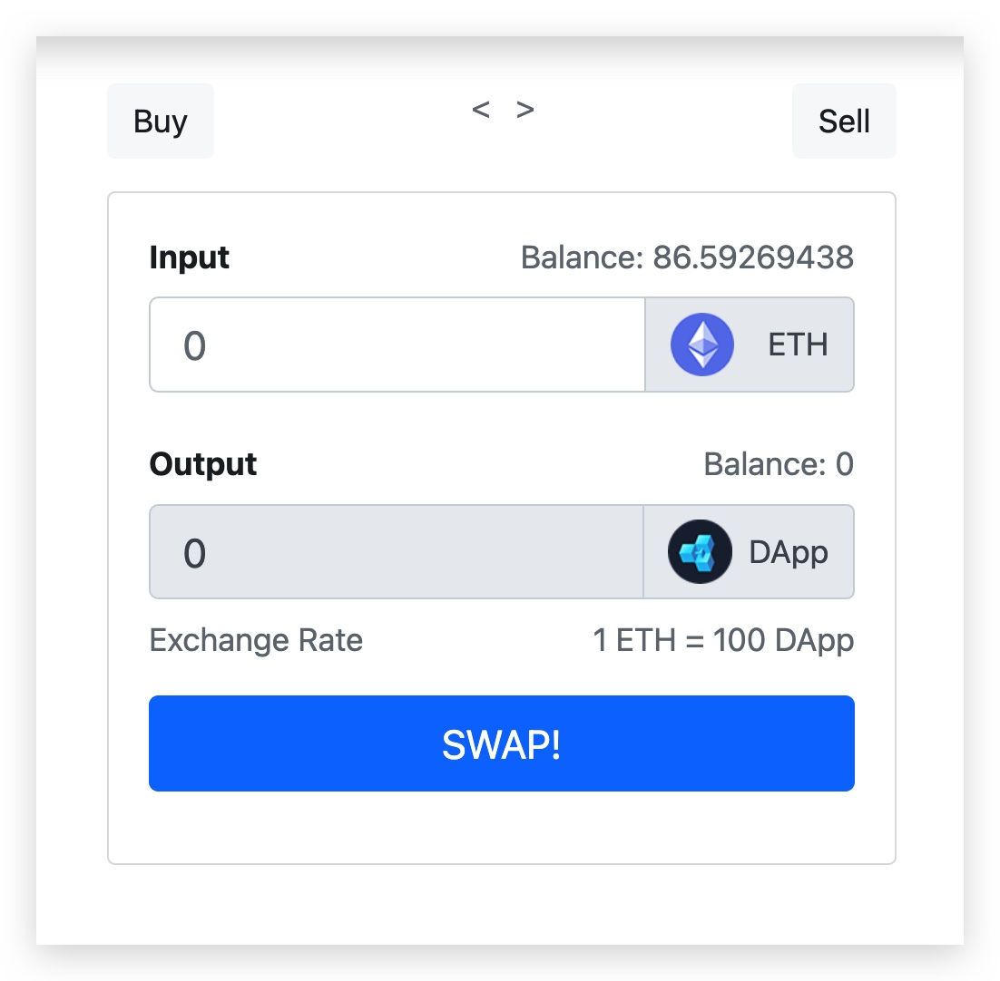

# EthSwap

Swap Ethereum with DAPP Token or buy DAPP token to get Ether!

## Description

This project is for just for learning how to create a simple DAPP application. It has a Token implemented based on Ethereum ERC-20 standard which can be bought using ethereum or can be sold to get ethereum.


## Getting Started

### Dependencies

- [Download](https://trufflesuite.com/ganache/index.html) Install Ganache locally and start. truffle will use this for dummy ethereum to deploy contracts.
- Install truffle globally `npm install truffle -g`

### Installing
```sh
npm install
```

### Executing program

* Run migration and deploy contracts
```
truffle migrate 
# add --reset to reset migrations
```

* Run test to check smart contracts
```
truffle test
```

* Check syntax errors of smart contracts
```
truffle compile
```
